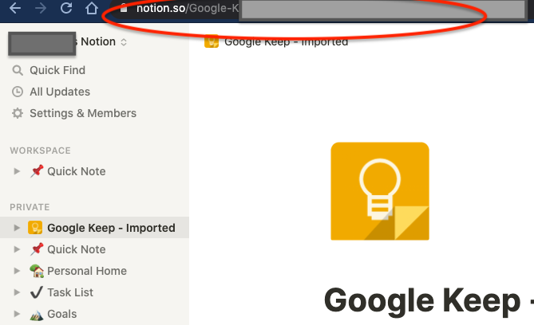

# notion-importer-google-keep

A simple utility that takes in the Google Keep Notes and exports it into the Notion

## How to Export Google Keep

Use Google take out https://takeout.google.com/
Find Google Keep and export them. The exported data is a zip file, unzip it into a folder


### Get the Token
Get the notion.so token from a session in your web browser


### Create a parent page
Create a page under which all the Google Keep Notes will be imported. Copy the url, will be used for the "--page" argument


## Run notion-import-google-Keep


### Install the utility

__Install__ Python3 and use the requirements.txt to install the dependency

### Run it

```
./import_data.py --token 'token' --page 'http://notion.so/asdfasdfsdfs' --dir 'dir where the pages are exported'
```